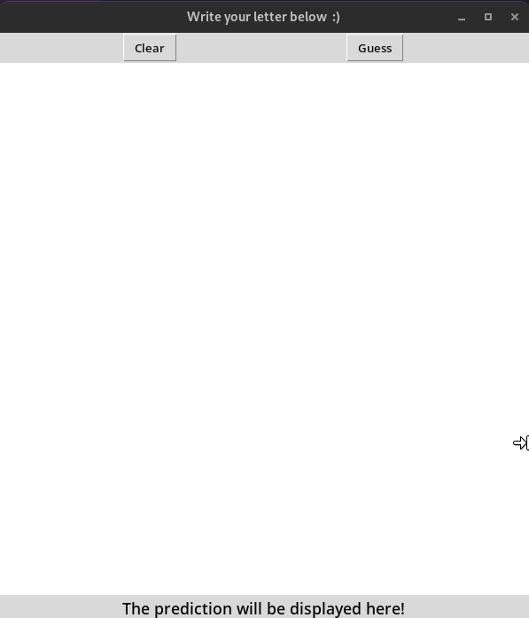

# Handwritten Letter Recognition

### Description 

This repository contains code for a project, which uses a convolutional neural network to predict a letter from a handwritten image. The code consists of two main files:

1. `paint.py` - contains a Tkinter application, which allows the user to draw a letter and make the neural network predict it.
2. `model_train.ipynb` - Jupyter notebook containing code used for training of the neural network

### Authors

The project was created by:

- Barbara Doncer - https://github.com/bdoncer
- Wojciech Dróżdż - https://github.com/behenate

### Dataset

Data used for training was taken from the [*EMNIST*](https://www.nist.gov/itl/products-and-services/emnist-dataset) dataset, specifically the  *EMNIST Letters* split of the dataset. The dataset contains  around 150000 samples of already balanced data split into training and test sets, therefore it was really convenient to use, and worked very well.

### Results

Trained neural network has a 91.5% accuracy on the test dataset, it also works well on data from the Tkinter app. It took around two minutes to train the network, it takes 5ns for the network to predict a letter.

### Application

Repository contains a Tkinter application that can be used to test the neural network on custom, handwritten inputs.

The GIF below is a demo of the application working:

### Structure of the Neural Network

The neural network consists of:

- Conv2D layer - filters: 32, kernel size: (3x3), activation: ReLU
- Max pooling layer - pool size: (2x2) 
- Conv2D layer - filters: 64, kernel size: (3x3), activation: ReLU
- Max pooling layer - pool size: (2x2) 
- Conv2D layer - filters: 128, kernel size: (3x3), activation: ReLU
- Max pooling layer - pool size: (2x2) 
- Flatten layer
- Dense layer - units: 64, activation: ReLU
- Dense layer - units: 128, activation: ReLU
- Dense layer - units: 26, activation: softmax

